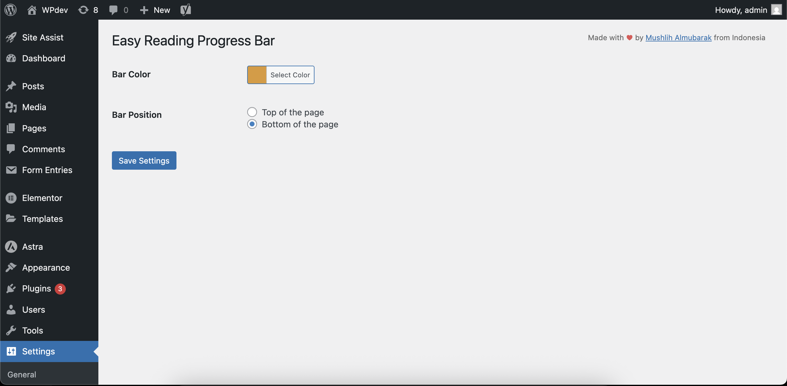
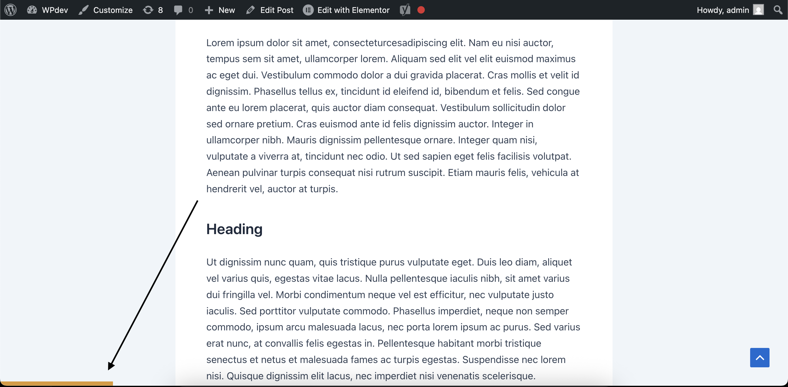

# Easy Reading Progress Bar for WordPress

A simple, lightweight, and highly compatible reading progress bar [plugin for your WordPress posts](https://wordpress.org/plugins/wp-easy-reading-progress-bar). This plugin is designed to be feather-light, incredibly fast, and work with the vast majority of WordPress themes.

[](https://www.codefactor.io/repository/github/mushlih-almubarak/easy-reading-progress-bar)
[](https://wordpress.org/plugins/wp-easy-reading-progress-bar)
[](https://www.gnu.org/licenses/gpl-2.0.html)
[](https://wordpress.org/plugins/wp-easy-reading-progress-bar)
[](https://wordpress.org/plugins/wp-easy-reading-progress-bar)
[](https://wordpress.org/plugins/wp-easy-reading-progress-bar)

## ✨ Key Features

* **Extremely Lightweight:** No extra CSS or JavaScript files are loaded. All code is inlined and optimized for peak performance.
* **Highly Compatible:** Works seamlessly with modern Block Themes, classic themes, and popular page builders.
* **Customizable:** Easily change the progress bar's color and position (top or bottom) from a simple settings page.
* **Dependency-Free:** The frontend script does not rely on jQuery, ensuring it won't conflict with other plugins.
* **Developer Friendly:** Includes a filter (`erpb_bar_height`) to programmatically change the bar's height.

## 🚀 Installation

#### From GitHub Repository:
1.  Download the latest release from the [releases page](https://github.com/mushlih-almubarak/easy-reading-progress-bar/releases/tag/1.0.0).
2.  In your WordPress dashboard, navigate to **Plugins > Add New**.
3.  Click **Upload Plugin** and select the `.zip` file you downloaded.
4.  Activate the plugin.
5.  Navigate to **Settings > Reading Progress Bar** to customize the options. That's it!
   
#### From WordPress.org Dashboard (wp-admin):
1.  Navigate to 'Plugins' > 'Add New'.
2.  Search for ['Easy Reading Progress Bar'](https://wordpress.org/plugins/wp-easy-reading-progress-bar).
3.  Click 'Install Now' and then 'Activate'.
4.  Go to 'Settings' > 'Reading Progress Bar' to customize the options. That's it!

## ❓ Frequently Asked Questions

#### 1. Will this plugin slow down my site?
Absolutely not. Performance is a core feature. The plugin only loads its tiny, optimized code on single post pages.

#### 2. Does this work with my theme?
Yes, most likely! The plugin was built for high compatibility. It intelligently detects the main content area in both classic and modern themes.

#### 3. Can I change the height of the bar?
Yes. While there is no setting for it in the plugin's settings page (to keep things simple), developers can use a WordPress filter to change the height. The default is 7px.
Example code to add to your theme's `functions.php` file to change the height to 10px:
```
add_filter( 'erpb_bar_height', function() {
    return '10';
} );
```

## 📜 Changelog

#### Version 1.0.0
- Initial public release.
- Features an easy, simple, lightweight, dependency-free reading progress bar for single posts.
- Includes a settings page to customize bar color and position.
- Designed for high compatibility with modern and classic themes.

## 🤝 Contributing
Contributions are welcome! If you find a bug or have a feature request, please open an issue on this GitHub repository. If you'd like to contribute code, please feel free to submit a pull request.

## 🙌 Donate
If you want to support me to continue developing open source projects, feel free to donate via [buymeacoffee](https://buymeacoffee.com/mushlih).

## 🖼️ Screenshots
#### Plugin settings page


#### A reading progress bar appears at the bottom of the page as the user scrolls down the page.



_This plugin was created with ❤️ by [Mushlih Almubarak](https://github.com/mushlih-almubarak) from Indonesia._
